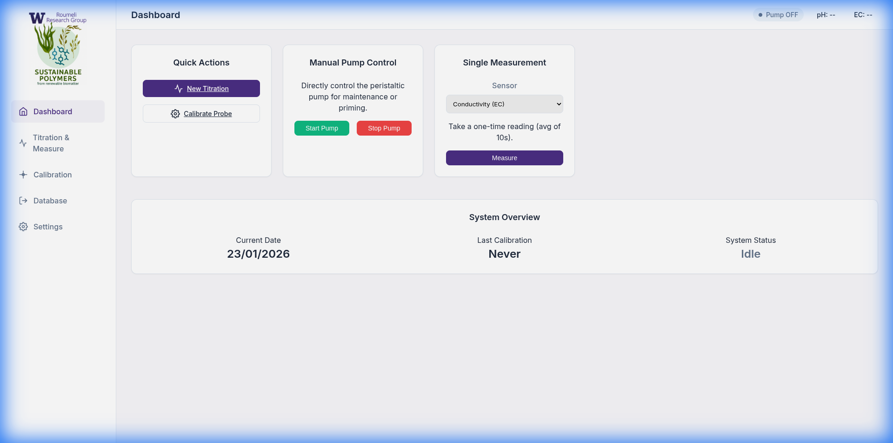
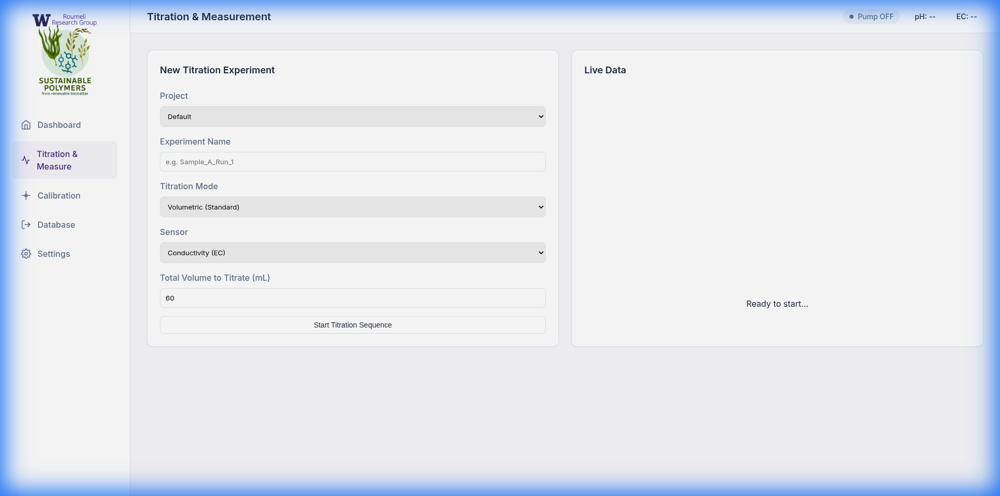
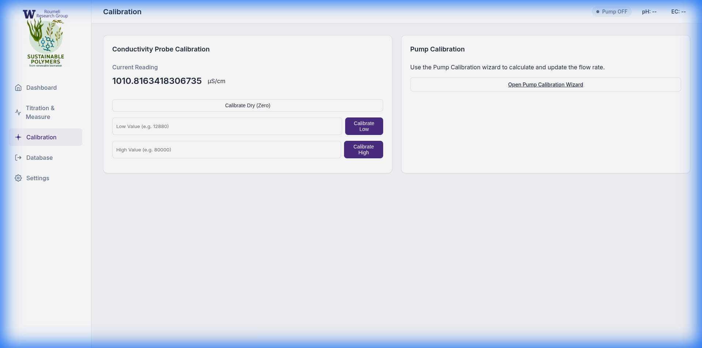
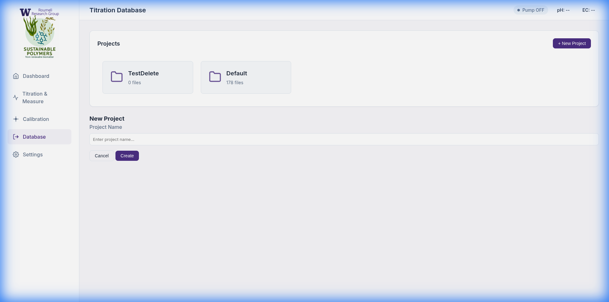

# AutoTitrator

An automated titration system built for Raspberry Pi, featuring a modern web interface, Atlas Scientific EZO sensor support (pH, conductivity, temperature), temperature-compensated readings, a two-constant gravimetric pump calibration, and full run provenance in every data file.

## 🚀 Features

### Titration
*   **Volumetric mode**: dose a fixed total volume in steps, recording conductivity vs volume.
*   **Endpoint mode (target pH)** with:
    *   a baseline reading at **v = 0** before any dosing,
    *   **adaptive stepping** — doses shrink to `step / divisor` once the pH is within a configurable window of the target, for sharp endpoint resolution,
    *   a **divergence guard** that aborts (with a clear error) if the pH moves away from the target for N consecutive steps — e.g. wrong titrant loaded,
    *   a per-run **max-volume safety cap**,
    *   **linear interpolation of the endpoint volume** between the last two points, reported in the UI and stored with the run.
*   **Temperature compensation**: before every run the RTD probe is read and `T,<temp>` is sent to the measuring EZO circuit, so pH/EC values are compensated in firmware. The temperature used is recorded with the run.
*   **Per-run advanced settings** (step volume, wait time, readings per point, max volume) with the **last 5 used combinations remembered** and selectable as presets.
*   **Run provenance**: every CSV carries a commented metadata header — titrant, analyte, initial sample volume, notes, solution temperature, all run parameters, and the pump/probe calibrations in force. Files remain machine-readable: `pandas.read_csv(path, comment='#')`.
*   Data is written to disk **after every step**, so an interrupted run keeps everything collected so far. Worker errors are surfaced in the UI, not just the logs.

### Single Measurement (Dashboard)
*   Timed single-probe measurement (pH, EC, or temperature) with a user-set max duration.
*   Readings polled ~every second and **plotted live vs time**.
*   **Plateau detection**: when the last N readings are stable (std below a per-sensor threshold), the stable value is selected automatically and the measurement stops early. If no plateau is reached, the mean of the final window is reported and flagged as such.
*   Survives a page reload — an in-progress measurement is picked up again automatically.

### Probe Calibration
*   **pH**: 3-point calibration (Atlas EZO `Cal,mid/low/high`) with editable buffer values. The UI enforces the firmware's requirement that **Mid (pH 7) is calibrated first** (Mid clears previous calibration data).
*   **Conductivity**: dry / low / high calibration.
*   **Temperature (RTD)**: single-point calibration against a known reference (ice bath, boiling water, or a NIST thermometer).
*   **Stability gating**: calibration buttons stay disabled until the live reading has stabilized (same thresholds as plateau detection). Double-click the stability chip to override.
*   **Electrode health**: the calibration page shows each probe's calibration state (`Cal,?`), the pH **electrode slope** (`Slope,?` — near 100 % is healthy, below ~90 % means clean or replace), and the EC cell constant (`K,?`).
*   **Per-device calibration dates** (pH / EC / RTD / pump) tracked separately and shown on the dashboard.

### Pump Calibration
The pump is relay-switched and dosed by time. Delivered volume per actuation follows the two-constant model:

```
V = Q × (t_on − τ)
```

where `Q` is the true flow rate and `τ` the per-actuation dead time (relay pull-in, spin-up, line pressurisation). `τ` is negligible over long runs and dominant for sub-second doses, so it is **fitted, not assumed zero**. The engine doses with `t_on = V/Q + τ`.

The guided wizard walks through:
1.  **Stage 0 — Bootstrap**: three continuous runs (5/10/15 s) for a rough `Q`.
2.  **Stage 1 — Duration series**: N pulses at six on-times spanning 0.5×–12× the operating point; weigh each trial.
3.  **Stage 2 — Fit**: least-squares of volume-per-pulse vs on-time (slope = `Q`, x-intercept = `τ`), with quality checks (R², residual RMS, replicate scatter, τ sign).
4.  **Auxiliary checks** *(recommended)*: burst-length check (N = 10/40/100 — detects a per-run priming penalty) and gap check (0.2 s vs 5 s — detects gap dependence).
5.  **Stage 3 — Verification**: 100 pulses at the calibrated step timing; pass if within 0.5 % of the target mass.
6.  **Quick re-cal**: two-minute routine for a fixed step size once a full calibration exists.

Water temperature (auto-read from the RTD probe) and the matching density are used throughout. Wizard state survives page reloads. The raw trial table is stored so the fit can be reproduced later.

A CLI version is included for bench use:
```bash
python3 pump_calibrate.py --simulate            # dry run, no hardware
python3 pump_calibrate.py --pin 23 --temp 24.5  # real
```

### Data Management
*   **Projects**: organize runs into folders; create/delete from the Database page.
*   **Plot & compare**: plot any stored run in the browser, or select several and overlay them; the metadata header is displayed under the chart.
*   **Export**: download individual CSVs or a whole project as a zip.

### Safety & Robustness
*   **Hardware interlock**: titration, single measurement, pump-calibration pulse trains, manual pump control, and probe calibration are mutually exclusive — starting one while another runs is refused with a clear message.
*   **Stop Pump is a panic button**: it stops the pump *and* signals any running activity (titration, measurement, pulse train) to stop.
*   **I2C collision protection**: display polling (status bar, calibration pages) is served through a short-lived cache and never touches the bus while a run owns it. Each real Atlas read blocks the bus ~2 s.
*   **Probe failure handling**: reads retry on Atlas error 254 (still processing) and transient failures; a titration aborts with a visible error after 3 consecutive failed readings instead of crashing silently.
*   **DEV-mode banner**: when not running on real hardware, every page shows an orange **"DEV MODE — ALL PROBE DATA IS SIMULATED"** banner, so mock data can never be mistaken for measurements.

## 📸 Screenshots

### Dashboard
The main dashboard provides quick access to titration, calibration, single measurements, and manual pump controls.



### Titration & Measurement
Configure and run titration experiments with real-time data monitoring.



### Calibration
Calibrate pH, conductivity, and temperature probes with guided interfaces.



### Database
Manage projects, plot and compare past titration experiments.



## 🛠 Hardware Requirements

*   **Raspberry Pi** (any model with 40-pin GPIO and I2C headers)
*   **Atlas Scientific EZO-pH Circuit** (default I2C address: `0x63`)
*   **Atlas Scientific EZO-EC Circuit** (default I2C address: `0x64`)
*   **Atlas Scientific EZO-RTD Circuit** (default I2C address: `0x66`) — used for temperature display, compensation of pH/EC readings, and density correction during pump calibration
*   **Peristaltic Pump** (controlled via relay on GPIO 23, active-LOW logic)
*   **12 V power supply** (for the pump)
*   **Relay module** (to interface the 12 V pump with 3.3 V Pi GPIO)

For pump calibration you additionally need an **analytical balance (0.001 g readability)**, a small tared beaker, and distilled water.

## 📦 Installation

1.  **Clone the repository**
    ```bash
    git clone git@github.com:Roumeli-Research-Group/Autotitrator.git
    cd Autotitrator
    ```

2.  **Install dependencies**
    ```bash
    pip3 install -r requirements.txt
    ```

3.  **Enable I2C (Raspberry Pi only)**
    *   Run `sudo raspi-config`
    *   Navigate to **Interface Options** → **I2C** → **Enable**
    *   Reboot the Pi.

## 🖥 Usage

### Running on the instrument (real hardware)

```bash
TITRATOR_ENV=PROD python3 run.py
```

*   `TITRATOR_ENV=PROD` is **required** for real hardware — without it, every probe and the pump are simulated. If you see the orange DEV banner in the browser, you are *not* talking to the instrument.
*   The server listens on port `5000` by default (`PORT=8080 ... run.py` to override).
*   Open `http://<pi-ip-address>:5000` in a browser on the same network.

For unattended operation, put the environment variable in the systemd unit or shell profile that launches the app.

### Development mode (mock hardware)

```bash
python3 run.py
```

Without `TITRATOR_ENV=PROD` the system runs entirely on mocks — the pump logs instead of switching GPIO, and the probes generate bounded random-walk data (pH ≈ 7, EC ≈ 1000 µS/cm, temp ≈ 22 °C). Every page shows the DEV banner.

### Recommended workflow for a new setup

1.  **Calibrate the RTD** (single point, ice bath is easiest) — temperature feeds everything else.
2.  **Calibrate pH** (Mid → Low → High, rinsing between buffers) and **EC** (dry → low → high). Check the electrode slope afterwards.
3.  **Run the full pump calibration wizard** (Calibration → Pump Calibration Wizard). Plumb the pump exactly as for a real titration — tubing, length, outlet height — and prime until bubble-free. Bubbles are the single largest error source.
4.  Run a titration. Fill in the **Sample Details** so the CSV records what was titrated with what.

### Reading the data files

Each run produces one CSV per experiment in `src/static/titrations/<Project>/`:

```
# Autotitrator run metadata
# mode: endpoint
# titrant: 0.1 M NaOH
# analyte: chitosan 1% w/v
# solution_temp_c: 22.05
# pump_Q_mls: 0.2711
# ...
Volume (mL),pH,StdDev,Mode
0.0,3.10,0.011,pH
0.125,3.42,0.014,pH
```

*   The first row is the v = 0 baseline.
*   `StdDev` is the spread of the averaged readings at each point — your per-point measurement uncertainty. A jump in `StdDev` means the electrode had not equilibrated.
*   Load with `pandas.read_csv(path, comment='#')`.

## 🧪 Tests

```bash
python3 -m pytest tests/
```

Covers the pump-calibration fit math, water density interpolation, dose timing (`t_on = V/Q + τ`), endpoint interpolation, stability thresholds, Atlas response parsing, and the API routes (interlocks, validation, path traversal, presets, calibration dates). No hardware needed — the suite runs against the mock layer.

## 📂 Project Structure

```
Autotitrator/
├── run.py                 # Application entry point (PORT env var supported)
├── pump_calibrate.py      # CLI pump calibration (all stages, --simulate)
├── config.json            # Persisted settings & calibrations
├── requirements.txt       # Python dependencies
├── tests/                 # Pytest suite (runs against mock hardware)
├── src/
│   ├── app.py             # Flask web server & API routes
│   ├── utils.py           # Configuration (auto-reloads on external change)
│   ├── measurement.py     # Timed single measurements + plateau detection
│   ├── pump_control.py    # Pulse-train driver, water density, Q/τ fit
│   ├── hardware/          # Hardware abstraction layer
│   │   ├── manager.py     # Hardware singleton & PROD/DEV selection
│   │   ├── pump.py        # Pump drivers (mock & real on GPIO 23)
│   │   ├── probes.py      # pH / EC / RTD drivers, health queries, mocks
│   │   └── drivers/       # Low-level Atlas I2C driver
│   ├── titration/         # Titration engine (dosing, guards, provenance)
│   ├── templates/         # HTML pages
│   └── static/
│       └── titrations/    # CSV data, one folder per project
└── docs/screenshots/
```

## 🔧 Configuration

All settings live in `config.json` and are editable from the **Settings** page:

| Group | Keys |
| --- | --- |
| Pump | `DEFAULT_FLOW_RATE`, `VOLUME_PER_STEP`; the wizard also stores `PUMP_FLOW_RATE_MLS` (Q), `PUMP_DEAD_TIME_S` (τ), and the full calibration record incl. raw trials |
| Timings | `TITRATION_WAIT_TIME`, `CONDUCTIVITY_READINGS`, `PH_READINGS`, `CONDUCTIVITY_READ_DELAY` |
| Endpoint mode | `ENDPOINT_MAX_VOLUME_ML`, `ENDPOINT_FINE_WINDOW_PH`, `ENDPOINT_FINE_DIVISOR`, `ENDPOINT_DIVERGENCE_STEPS` |
| Stability | `STABILITY_WINDOW`, `PH_STABILITY_THRESHOLD`, `EC_STABILITY_THRESHOLD_PCT`, `TEMP_STABILITY_THRESHOLD` |
| Bookkeeping | per-device calibration dates, last 5 titration presets |

`config.json` is re-read automatically if another process (e.g. `pump_calibrate.py`) changes it while the server is running.

## 🤝 Contributing

1.  Fork the repository
2.  Create your feature branch (`git checkout -b feature/AmazingFeature`)
3.  Commit your changes (`git commit -m 'Add some AmazingFeature'`)
4.  Push to the branch (`git push origin feature/AmazingFeature`)
5.  Open a Pull Request

Run `python3 -m pytest tests/` before opening a PR.
